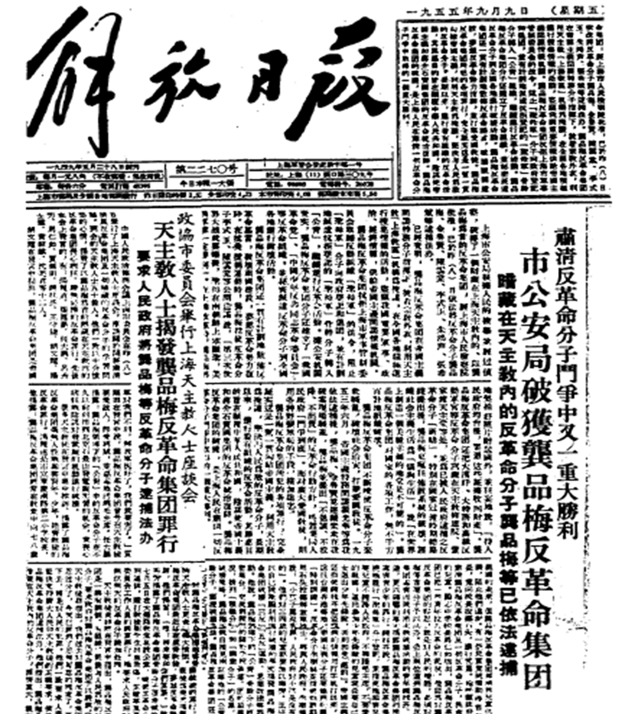

<iframe width="560" height="315" src="https://www.youtube-nocookie.com/embed/xyIN36jiVzo?si=XWvQ10E05L3P2h-U" title="YouTube video player" frameborder="0" allow="accelerometer; autoplay; clipboard-write; encrypted-media; gyroscope; picture-in-picture; web-share" referrerpolicy="strict-origin-when-cross-origin" allowfullscreen></iframe>

## 上海天主教四百年大事录 | Four Centuries of Catholicism in Shanghai
> 从徐光启到今天，主教究竟由谁任命？ | From Xu Guangqi to Today — Who Appoints the Bishop?

如果想理解中国天主教与国家之间的关系，上海可能是最值得观察的教区之一。

因为上海四百多年的天主教历史，几乎完整经历了：

晚明传教
→ 教区制度形成
→ 中国籍主教出现
→ 1949年后政教冲突
→ “自选自圣”
→ 地下与公开教会双轨并存
→ 罗马逐步承认部分公开体系主教
→ 2018年梵中主教任命协议
→ 2023年沈斌事件
→ 现在逐渐形成双方协调的任命模式

如果把历史浓缩到一个核心问题，其实就是：

“上海主教，究竟由谁任命？”

If we want to understand the relationship between the Catholic Church and the Chinese state, Shanghai is probably one of the most revealing dioceses to study.

Over more than four centuries, the Catholic Church in Shanghai has experienced almost every major phase of Church–state relations in modern China:

late-Ming missionary activity
→ the formation of diocesan structures
→ the emergence of Chinese bishops
→ Church–state conflict after 1949
→ the system of “self-election and self-consecration”
→ the parallel existence of underground and state-recognized Catholic structures
→ Rome’s gradual recognition of some bishops from the official system
→ the 2018 Vatican–China agreement on episcopal appointments
→ the 2023 Shen Bin controversy
→ and, more recently, attempts to establish a coordinated appointment process.

If this long history is reduced to one central question, it is simply this:

“Who ultimately has the authority to appoint the Bishop of Shanghai?”

———

### 1603–1933：天主教进入上海，但上海还没有自己的主教

1603年，上海人徐光启在南京领洗，圣名保禄。他后来与利玛窦等耶稣会士建立密切关系，成为中国天主教史上最重要的早期平信徒之一。

1607–1608年前后，徐光启因父丧返回上海，并邀请耶稣会士郭居静（Lazzaro Cattaneo）来到上海传教。不同史料在具体年份上略有差异，但上海教会传统一般把1608年视为上海天主教会正式建立的重要起点。此后，郭居静为徐氏家族以及不少上海人施洗。

1637年，耶稣会士潘国光（Francesco Brancati）在上海老城修建天主堂，这成为后来上海“老天主堂”传统的重要起点。

不过，这时上海并没有自己的主教。1660年前后，上海属于南京宗座代牧区。1690年，教宗亚历山大八世将南京宗座代牧区升格为南京教区，因此上海长期处于南京主教的管辖之下。

1842年以后，法国耶稣会士重新进入上海和江南地区。徐家汇逐渐发展为中国最重要的天主教文化、教育、修院和出版中心之一。

1856年，南京教区调整为江南宗座代牧区。1921–1922年前后，教会辖区继续调整，但上海仍然没有成为独立教区。

也就是说，上海从1608年前后已经拥有相当成熟的天主教团体，但一直到1933年，才真正拥有独立的上海教会辖区。

【1603–1933: Catholicism Comes to Shanghai, but Shanghai Does Not Yet Have Its Own Bishop】

In 1603, Xu Guangqi, a native of Shanghai, was baptized in Nanjing and took the Christian name Paul. He later developed a close relationship with Matteo Ricci and other Jesuit missionaries and became one of the most important early Catholic laymen in Chinese Church history.

Around 1607–1608, Xu returned to Shanghai following the death of his father and invited the Jesuit missionary Lazzaro Cattaneo to begin missionary work there. Historical sources differ slightly on the exact date, but Shanghai Catholic tradition generally regards 1608 as an important starting point for the formal establishment of the Catholic Church in Shanghai. Cattaneo subsequently baptized members of Xu Guangqi’s family and a growing number of Shanghai residents.

In 1637, the Jesuit Francesco Brancati built a Catholic church in the old city of Shanghai, becoming an important early foundation of what later developed into Shanghai’s “Old Catholic Church” tradition.

Shanghai, however, did not yet have its own bishop. Around 1660, Shanghai formed part of the Apostolic Vicariate of Nanjing. In 1690, Pope Alexander VIII elevated the Nanjing vicariate to the Diocese of Nanjing, and Shanghai therefore remained for a long period under the ecclesiastical jurisdiction of the Bishop of Nanjing.

After 1842, French Jesuits re-established a strong missionary presence in Shanghai and the Jiangnan region. Xujiahui gradually became one of China’s most important Catholic centers for education, seminaries, publishing, science, and culture.

In 1856, the ecclesiastical structure was reorganized as the Apostolic Vicariate of Jiangnan. Further territorial changes followed around 1921–1922, but Shanghai still did not yet constitute an independent ecclesiastical jurisdiction.

In other words, Shanghai had possessed a substantial Catholic community since around 1608, but it was not until 1933 that Shanghai finally obtained its own independent ecclesiastical jurisdiction.

———

### 1933：真正意义上的“上海主教史”开始

1933年12月13日，教宗庇护十一世把上海地区从南京宗座代牧区划出，建立：

Apostolic Vicariate of Shanghai
上海宗座代牧区

并任命法国耶稣会士 Auguste Haouisée, SJ（惠济良主教）为第一任上海宗座代牧。

严格来说，当时上海还不是正式 Diocese，所以惠济良的职位是 Vicar Apostolic of Shanghai，即上海宗座代牧，而不是今天普通意义上的教区正权主教。

【1933: The History of the Bishops of Shanghai Properly Begins】

On 13 December 1933, Pope Pius XI separated Shanghai from the Apostolic Vicariate of Nanjing and established the Apostolic Vicariate of Shanghai.

He appointed the French Jesuit Auguste Haouisée, SJ, as the first Apostolic Vicar of Shanghai.

Strictly speaking, Shanghai was not yet a full diocese. Haouisée therefore held the title Vicar Apostolic of Shanghai rather than diocesan bishop in the modern canonical sense.

———

### 1946：上海正式成为教区

1946年4月11日，教宗庇护十二世在中国建立正式圣统制。

上海宗座代牧区升格为 Diocese of Shanghai，即上海教区，并成为南京总教区的属下教区。惠济良因此成为上海教区第一任正式教区主教。

这件事非常重要。因为1946年以前，中国很多地区仍然被视为“传教地区”；1946年以后，圣座正式把中国视为拥有正常地方教会结构的成熟教会。

【1946: Shanghai Becomes a Full Diocese】

On 11 April 1946, Pope Pius XII established the normal ecclesiastical hierarchy in China.

The Apostolic Vicariate of Shanghai was elevated to the Diocese of Shanghai and became a suffragan diocese of the Archdiocese of Nanjing. Haouisée therefore became the first diocesan Bishop of Shanghai.

This was a highly significant development. Before 1946, much of the Catholic Church in China was still canonically organized as missionary territory. After 1946, the Holy See formally recognized China as possessing a mature local Church with a normal diocesan hierarchy.

———

### 1948–1950：上海第一位中国籍主教——龚品梅

1948年9月10日，惠济良去世。

随后出现了上海天主教史上最重要的人物之一：Ignatius Gong Pinmei，龚品梅。

1949年6月9日，教宗庇护十二世首先任命龚品梅为苏州教区主教。1949年10月7日，龚品梅接受主教祝圣。1950年，圣座将龚品梅调任上海教区。

他由此成为上海历史上第一位中国籍教区主教。

这一点特别值得注意。因为有时会把1949年前的中国天主教简单描述成“外国人控制的教会”。但实际上，在中华人民共和国成立前后，圣座已经在迅速把中国地方教会交给中国籍主教。龚品梅就是其中最重要的人物之一。

【1948–1950: Shanghai’s First Chinese Bishop — Ignatius Gong Pinmei】

Auguste Haouisée died on 10 September 1948.

One of the most important figures in the history of Shanghai Catholicism then emerged: Ignatius Gong Pinmei.

On 9 June 1949, Pope Pius XII first appointed Gong Bishop of Suzhou. He was consecrated a bishop on 7 October 1949. In 1950, the Holy See transferred him to the Diocese of Shanghai.

He therefore became the first Chinese diocesan Bishop of Shanghai.

This point is particularly important. Pre-1949 Catholicism in China is sometimes described simply as a Church controlled by foreigners. In reality, around the time of the establishment of the People’s Republic, the Holy See was already rapidly transferring leadership of local dioceses to Chinese bishops. Gong Pinmei was one of the most important examples of this process.

———

### 1955：上海主教问题正式变成政治问题

1950年代初，新政府要求中国天主教逐渐摆脱所谓“外国势力控制”，推动“独立自主、自办教会”。

龚品梅拒绝上海教会脱离与教宗的圣统共融。

1955年9月8日，龚品梅以及大量上海神父、修道人和教友遭到逮捕。1960年，他被判处无期徒刑。

从这一刻开始，一个后来持续数十年的根本问题出现了：

谁有权决定上海主教？

罗马的答案是：Pope。

而中国政府逐渐形成的答案是：中国天主教应当“独立自主”，主教可以“自选自圣”。

这就是后来上海教区公开教会与地下教会分裂的重要根源。

【1955: The Question of the Bishop of Shanghai Becomes a Political Conflict】

In the early 1950s, the new government increasingly demanded that Catholic communities in China free themselves from what it described as “foreign control” and adopt the principle of “independence and self-administration.”

Gong Pinmei refused to separate the Catholic Church in Shanghai from hierarchical communion with the Pope.

On 8 September 1955, Gong, together with many priests, religious, and lay Catholics in Shanghai, was arrested. In 1960, he was sentenced to life imprisonment.

From this point onward, a fundamental dispute emerged that would continue for decades:

Who had the authority to determine who was Bishop of Shanghai?

Rome’s answer was: the Pope.

The emerging position of the Chinese authorities was that the Catholic Church in China should be independent and self-administered, and bishops could be “self-elected and self-consecrated.”

This became one of the principal roots of the later division between the state-recognized and underground Catholic communities in Shanghai.

———

### 1957–1960：“自选自圣”开始

1957年，中国天主教爱国会成立。

其中最核心的原则之一就是“独立自主自办”。在主教任命上，它逐渐发展成“自选自圣”。

也就是说，中国境内的天主教可以自行选举并祝圣主教，而不以教宗任命为必要条件。

1960年，上海方面选举耶稣会士 Louis Zhang Jiashu, SJ（张家树）为上海主教，并在徐家汇接受主教祝圣。但是这次祝圣没有得到教宗授权。

于是1960年以后，上海第一次出现了两个不同的主教合法性体系。

罗马认为：龚品梅仍然是上海正权主教。虽然他人在监狱里，但他的主教职务并没有因为政府另立主教而消失。

而中国官方体系则认为：张家树是上海主教。

于是同一个上海教区，开始同时存在两套不同的权威来源：

一套来自教宗任命。

一套来自“自选自圣”。

【1957–1960: The Beginning of “Self-Election and Self-Consecration”】

In 1957, the Chinese Catholic Patriotic Association was established.

One of its central principles was independence and self-administration. In episcopal affairs, this gradually developed into the policy of “self-election and self-consecration.”

In practical terms, this meant that Catholic communities within China could elect and consecrate bishops without treating papal appointment as a necessary condition.

In 1960, the Shanghai authorities selected the Jesuit Louis Zhang Jiashu, SJ, as Bishop of Shanghai, and he was consecrated at Xujiahui. The consecration, however, had not received papal authorization.

From 1960 onward, Shanghai therefore had two competing systems of episcopal legitimacy.

Rome continued to regard Gong Pinmei as the legitimate diocesan Bishop of Shanghai. Although he was imprisoned, his canonical office did not disappear simply because another bishop had been established by the state-recognized system.

The state-recognized Catholic system, however, regarded Zhang Jiashu as Bishop of Shanghai.

The same Diocese of Shanghai therefore came to contain two competing sources of episcopal authority:

one derived from papal appointment,

and another derived from “self-election and self-consecration.”

———

### 1966–1976：文化大革命

文化大革命时期，上海和全国其他地方一样：

教堂关闭，公开弥撒停止，修院关闭，神职人员受到严重冲击。

因此这一阶段的问题已经不仅仅是“谁是上海主教？”，而是整个公开教会生活几乎都无法正常存在。

【1966–1976: The Cultural Revolution】

During the Cultural Revolution, Shanghai experienced the same destruction of religious life seen elsewhere in China:

churches were closed, public Masses ceased, seminaries were shut down, and clergy suffered severe persecution and political pressure.

The problem during this period was therefore no longer merely “Who is the Bishop of Shanghai?” Public Catholic life itself had become almost impossible.

———

### 1979–1991：龚品梅成为枢机

1979年，教宗若望保禄二世秘密册封仍在中国受囚禁的龚品梅为 Cardinal in pectore，即“默存心中的枢机”。

直到1991年，这一任命才正式公开。

这一行动具有非常强烈的象征意义：

罗马从来没有因为中国政府另立主教，而认为龚品梅失去了上海主教的合法身份。

【1979–1991: Gong Pinmei Becomes a Cardinal】

In 1979, Pope John Paul II secretly created the imprisoned Gong Pinmei Cardinal in pectore—a cardinal whose appointment was kept “in the heart” of the Pope.

The appointment was made public only in 1991.

The gesture carried enormous symbolic significance:

Rome had never accepted that Gong lost his legitimate episcopal status merely because another bishop had been appointed within the Chinese state-recognized system.

———

### 1985：上海出现最复杂的“双主教体系”

1985年是上海天主教历史中最关键的年份之一。这一年出现了两位完全不同来源的上海主教。

第一位是 Aloysius Jin Luxian, SJ，金鲁贤。

1985年，金鲁贤在政府认可的公开教会体系内接受主教祝圣，但当时没有事先获得教宗批准。

与此同时，在地下教会体系中，Joseph Fan Zhongliang, SJ，范忠良，也在1985年秘密接受主教祝圣。

他成为上海教区的助理主教，并拥有继承权，服务于当时圣座仍然承认的正权主教龚品梅。

因此1980年代的上海实际上出现了三个人同时与“上海主教权”有关：

龚品梅——圣座承认的正权主教。

范忠良——地下体系、圣座认可的继承权主教。

金鲁贤——政府认可、公开教会体系中的主教。

这就是中国天主教“公开教会 / 地下教会”分裂最典型的结构之一。

【1985: Shanghai Develops Its Most Complex Dual-Bishop Structure】

1985 was one of the most consequential years in the history of the Catholic Church in Shanghai. Two bishops emerged from completely different systems of authority.

The first was Aloysius Jin Luxian, SJ.

In 1985, Jin was consecrated a bishop within the state-recognized Catholic structure. At the time, however, he had not received prior papal approval.

At almost the same time, within the underground Catholic structure, Joseph Fan Zhongliang, SJ, was secretly consecrated a bishop.

He became coadjutor bishop of Shanghai, with the right of succession, under Gong Pinmei, whom the Holy See continued to recognize as the legitimate diocesan bishop.

Shanghai therefore entered an extraordinary situation in which three men were simultaneously connected with episcopal authority over the diocese:

Gong Pinmei — the diocesan bishop recognized by the Holy See.

Joseph Fan Zhongliang — the Vatican-recognized coadjutor bishop within the underground Church.

Aloysius Jin Luxian — the bishop recognized by the state-approved Catholic structure.

This became one of the clearest examples of the division between China’s official and underground Catholic communities.

———

### 1988–2000：两条上海主教线并行

1988年张家树去世后，金鲁贤成为公开教会体系实际上的上海教会领导人。

但圣座仍然认为龚品梅是上海正权主教。

于是这一时期可以非常简单地理解成：

Rome：

龚品梅 → 范忠良

Beijing：

金鲁贤

两条线同时存在。

【1988–2000: Two Parallel Episcopal Lines in Shanghai】

After Zhang Jiashu died in 1988, Jin Luxian became the effective leader of the state-recognized Catholic Church in Shanghai.

The Holy See, however, continued to regard Gong Pinmei as the legitimate diocesan bishop.

The situation can therefore be summarized very simply:

Rome:

Gong Pinmei → Joseph Fan Zhongliang

Beijing:

Aloysius Jin Luxian

Two parallel lines existed within the same diocese.

———

### 2000：龚品梅去世，范忠良继任

2000年3月12日，龚品梅枢机在美国去世。

由于范忠良原本就是拥有继承权的助理主教，因此按照天主教圣统制度，范忠良成为上海教区正权主教。

圣座承认范忠良是上海教区主教，但是中国政府并不承认他的这一身份。

因此上海继续维持：

罗马：范忠良

政府：金鲁贤

这样的双轨状态。

【2000: Gong Pinmei Dies and Joseph Fan Zhongliang Succeeds Him】

On 12 March 2000, Cardinal Gong Pinmei died in the United States.

Because Joseph Fan Zhongliang had already been appointed coadjutor bishop with right of succession, according to Catholic canon law, Fan became the diocesan Bishop of Shanghai.

The Holy See recognized Joseph Fan Zhongliang as Bishop of Shanghai. The Chinese government, however, did not recognize him in that capacity.

Shanghai therefore continued to operate under a dual reality:

Rome: Joseph Fan Zhongliang

State-recognized system: Aloysius Jin Luxian.

———

### 2000年代：一个非常重要的变化——金鲁贤与罗马修和

金鲁贤后来主动与圣座恢复共融，并请求解决自己1985年未经教宗授权祝圣所产生的教会法问题。

圣座最终接受了他的和解。

公开资料对于具体教会法补正年份存在一些差异，大致在2004–2005年前后。到2005年，梵蒂冈已经公开把金鲁贤列为受教宗邀请参加世界主教会议的中国主教之一。

他的身份最终被理解为上海教区助理主教 / coadjutor，而范忠良仍然是正权主教。

这是一个非常重要的变化。

因为罗马实际上开始接受这样一种可能：

一个原本在没有教宗授权情况下接受祝圣的公开体系主教，如果后来主动寻求并恢复与教宗的圣统共融，他的主教身份可以得到教会法上的补正和承认。

【The 2000s: A Major Change — Jin Luxian Reconciles with Rome】

Jin Luxian later sought communion with the Holy See and requested resolution of the canonical irregularity created by his 1985 episcopal consecration without prior papal authorization.

The Holy See eventually accepted his reconciliation.

Public sources differ somewhat regarding the exact year of canonical regularization, generally placing it around 2004–2005. By 2005, however, the Vatican was publicly treating Jin as one of the Chinese bishops invited by the Pope to participate in the Synod of Bishops.

His canonical position was eventually understood as coadjutor bishop of Shanghai, while Joseph Fan Zhongliang remained the diocesan bishop.

This represented an important development.

Rome was effectively accepting the possibility that a bishop originally consecrated within the official system without prior papal authorization could later seek communion with the Pope and have his canonical status regularized.

———

### 2005：邢文之——第一次出现比较成熟的“双认可”模式

2005年6月28日，Joseph Xing Wenzhi（邢文之）接受上海辅理主教祝圣。

这个案例非常重要，因为中国方面接受他，圣座也批准他。

当时很多人曾经期待，邢文之最终能够同时继承范忠良和金鲁贤，从而结束上海地下和公开教会长期存在的双轨结构。

但后来，邢文之退出继任安排，并逐渐淡出公开教会生活。2023年，梵蒂冈国务卿帕罗林枢机公开称他已经 retired。

【2005: Joseph Xing Wenzhi — An Early Model of Mutual Recognition】

On 28 June 2005, Joseph Xing Wenzhi was consecrated Auxiliary Bishop of Shanghai.

This was especially important because the Chinese authorities accepted him and the Holy See also approved him.

At the time, many hoped that Xing might eventually succeed both Fan Zhongliang and Jin Luxian, thereby ending the long-standing parallel structures of the underground and official Catholic communities in Shanghai.

Xing later withdrew from the succession arrangement and gradually disappeared from active public episcopal ministry. In 2023, Vatican Secretary of State Cardinal Pietro Parolin publicly described him as retired.

———

### 2012：马达钦事件

这是中国现代天主教史上最有象征性的事件之一。

Thaddeus Ma Daqin，马达钦，在2012年成为上海辅理主教人选。

这一次，圣座认可，中国方面也认可。

2012年7月7日，马达钦在徐家汇主教座堂接受合法主教祝圣。圣座随后公开表示，他的祝圣是合法的。

但是在祝圣弥撒中，马达钦宣布：为了专心牧灵，他不再适合继续担任天主教爱国会的职务。

现场教友鼓掌。

随后局势迅速改变。

马达钦被限制在佘山修院，无法正常履行主教牧职。中国方面后来取消了他在官方体系中的主教资格或认可。

但圣座从来没有取消他的主教身份。

直到2025年，圣座传信机构 Fides 仍明确表示：

“Holy See continues to recognize Ma Daqin as auxiliary bishop of Shanghai.”

也就是说，马达钦直到今天，从圣座的角度仍然是上海辅理主教，只是他的牧职受到长期限制。

这个事件非常清楚地说明：

“政府承认的主教”

和

“Catholic Church 法理上的主教”

并不一定是同一个概念。

【2012: The Thaddeus Ma Daqin Affair】

This became one of the most symbolic episodes in the modern history of Catholicism in China.

In 2012, Thaddeus Ma Daqin was selected as a candidate for Auxiliary Bishop of Shanghai.

This time, the Holy See approved him and the Chinese authorities also accepted him.

On 7 July 2012, Ma was validly and licitly consecrated a bishop at the cathedral in Xujiahui. The Holy See subsequently publicly welcomed the legitimacy of his consecration.

During the consecration Mass, however, Ma announced that, in order to devote himself fully to pastoral ministry, it was no longer appropriate for him to continue holding office in the Chinese Catholic Patriotic Association.

The congregation responded with applause.

The situation changed almost immediately.

Ma was restricted at the Sheshan seminary and prevented from exercising normal episcopal ministry. The official Catholic structure later removed or ceased to recognize his episcopal position.

The Holy See, however, never withdrew its recognition of Ma’s episcopal status.

As late as 2025, the Vatican missionary news agency Fides explicitly stated:

“The Holy See continues to recognize Ma Daqin as auxiliary bishop of Shanghai.”

In other words, from the Holy See’s perspective, Ma remains an Auxiliary Bishop of Shanghai. He has simply been prevented from exercising his ministry normally for many years.

The episode illustrates a crucial distinction:

a bishop recognized by the state

and

a bishop recognized canonically by the Catholic Church

are not necessarily the same thing.

———

### 2013–2014：金鲁贤、范忠良相继去世

2013年4月27日，金鲁贤去世。

2014年3月16日，范忠良去世。

理论上，马达钦原本应该逐渐承担上海教区的实际牧职。但由于他受到限制，这种安排无法实现。

于是上海教区进入了相当长时间的事实性 sede vacante，即主教座出缺状态。

【2013–2014: The Deaths of Jin Luxian and Fan Zhongliang】

Aloysius Jin Luxian died on 27 April 2013.

Joseph Fan Zhongliang died on 16 March 2014.

In principle, Ma Daqin might then have gradually assumed effective pastoral responsibility for the Diocese of Shanghai. Because of the restrictions imposed upon him, however, this could not occur.

Shanghai consequently entered a prolonged period that was effectively characterized by sede vacante—a vacant episcopal see.

———

### 2018：梵中《主教任命临时协议》

2018年9月22日，Holy See 与 People’s Republic of China 签署：

Provisional Agreement regarding the Appointment of Bishops
《关于主教任命的临时协议》

协议全文至今没有公开。

但目标非常明确：

尽量结束过去那种“北京任命一个主教，罗马承认另一个主教”的双轨体系。

协议后来在2020、2022年续期。2024年10月22日，双方再次将协议延长四年，到2028年。

从主教任命角度看，这代表一个重要转变。

以前是：

Beijing appoints / Rome appoints

而协议试图建立的新模式是：

双方寻找一个双方可以接受的人选，

但最终教会法意义上的任命由 Pope 完成。

【2018: The Vatican–China Provisional Agreement on the Appointment of Bishops】

On 22 September 2018, the Holy See and the People’s Republic of China signed the Provisional Agreement regarding the Appointment of Bishops.

The full text of the agreement has never been publicly released.

Its general objective, however, is clear:

to reduce and eventually end the previous situation in which Beijing recognized one bishop while Rome recognized another.

The agreement was renewed in 2020 and again in 2022. On 22 October 2024, the two sides extended it for another four years, until 2028.

From the perspective of episcopal appointments, this represented a major shift.

The previous model was effectively:

Beijing appoints / Rome appoints.

The agreement attempts to create a new model:

both sides work toward an acceptable candidate,

while the final canonical appointment is made by the Pope.

———

### 2023：沈斌事件——上海再次成为梵中协议的试金石

Joseph Shen Bin，沈斌，原本是海门教区主教。

2023年4月，中国方面把沈斌调到上海，并举行就职。

问题在于：

圣座事先虽然得到通知，但没有参与这个调任决定。

这一点并不是媒体猜测。

梵蒂冈国务卿 Cardinal Pietro Parolin 后来亲自公开确认：

“Holy See was informed, but was not involved in the decision.”

于是形成了一个 canonical irregularity，即教会法上的不规则状态。

【2023: The Shen Bin Affair — Shanghai Again Becomes a Test of the Vatican–China Agreement】

Joseph Shen Bin had previously served as Bishop of Haimen.

In April 2023, the Chinese side transferred Shen to Shanghai and installed him there.

The problem was that, although the Holy See was informed beforehand, it had not participated in the decision to transfer him.

This was not merely media speculation.

Vatican Secretary of State Cardinal Pietro Parolin later publicly confirmed that:

“the Holy See was informed, but was not involved in the decision.”

This created what the Vatican described as a canonical irregularity.

———

### 2023年7月15日：教宗方济各正式任命沈斌

三个月以后，Pope Francis 正式任命 Joseph Shen Bin（沈斌）为 Bishop of Shanghai，即上海教区主教。

帕罗林枢机解释说，教宗这样做，是为了：

“rectify the canonical irregularity”

也就是补正已经形成的教会法不规则状态。

但圣座同时非常明确地指出，中国方面此前单方面调任沈斌的做法，并不符合双方协议所希望建立的对话与合作精神。

因此沈斌事件的时间顺序非常重要：

中国方面先调任并就职

↓

圣座没有参与决定

↓

产生教会法不规则状态

↓

教宗方济各后来正式任命沈斌

↓

圣座同时公开表示，中方此前的单方面行动存在问题

所以不能简单说：

“梵蒂冈接受了中国政府任命的上海主教。”

更加准确的说法应该是：

中国先进行了事实调任，然后教宗后来通过正式任命，把教会法上的问题补正。

【15 July 2023: Pope Francis Formally Appoints Shen Bin】

Three months later, Pope Francis formally appointed Joseph Shen Bin as Bishop of Shanghai.

Cardinal Parolin explained that the Pope’s decision was intended to:

“rectify the canonical irregularity”

that had already arisen.

At the same time, the Holy See made clear that the earlier unilateral transfer by the Chinese side did not conform to the spirit of dialogue and cooperation that the agreement was intended to establish.

The chronology of the Shen Bin affair is therefore crucial:

the Chinese side first transferred and installed him

↓

the Holy See had not participated in the decision

↓

a canonical irregularity arose

↓

Pope Francis later formally appointed Shen

↓

the Holy See simultaneously made clear that the previous unilateral action had been problematic.

It is therefore inaccurate simply to say:

“The Vatican accepted the bishop appointed by the Chinese government.”

A more precise description is:

China first carried out the transfer as a matter of fact, and the Pope subsequently regularized the situation through a formal canonical appointment.

———

### 2025：吴建林——更加接近协议预期的模式

Ignatius Wu Jianlin，吴建林。

2025年4月，上海方面选举吴建林为辅理主教候选人。

2025年8月11日，教宗良十四世正式批准并任命吴建林为上海辅理主教。

2025年10月15日，吴建林在徐家汇主教座堂接受主教祝圣。

圣座明确说明，教宗是在梵中《主教任命临时协议》的框架内批准其候选资格并作出任命。

因此吴建林与2023年的沈斌案例明显不同。

吴建林更接近：

中国方面产生候选人

↓

双方通过协议机制沟通

↓

Pope 正式批准和任命

↓

接受主教祝圣

这正是2018年梵中协议试图建立的主教产生方式。

【2025: Ignatius Wu Jianlin — A Model Closer to the Intended Agreement Process】

In April 2025, Ignatius Wu Jianlin was elected on the Shanghai side as a candidate for auxiliary bishop.

On 11 August 2025, Pope Leo XIV formally approved and appointed Wu as Auxiliary Bishop of Shanghai.

On 15 October 2025, Wu was consecrated a bishop at the cathedral in Xujiahui.

The Holy See explicitly stated that the Pope had approved Wu’s candidacy and made the appointment within the framework of the Vatican–China Provisional Agreement on the appointment of bishops.

Wu’s case therefore differed significantly from the Shen Bin affair of 2023.

It more closely followed the intended pattern:

a candidate emerges on the Chinese side

↓

consultation occurs through the agreement mechanism

↓

the Pope formally approves and appoints

↓

episcopal consecration follows.

This is much closer to the episcopal appointment process that the 2018 Vatican–China agreement was designed to establish.

———

### 截至2026年，上海到底有几位主教？

现在上海的情况非常特别。

正权主教：

Joseph Shen Bin
沈斌

2023年7月15日由教宗方济各正式任命。

因此：

圣座承认
＋
中国政府承认

辅理主教：

Ignatius Wu Jianlin
吴建林

2025年由教宗良十四世在梵中协议框架下任命。

因此同样：

圣座承认
＋
中国政府承认

但还有一位：

Thaddeus Ma Daqin
马达钦

他在2012年已经由圣座合法任命并接受合法主教祝圣。

而且直到2025年，圣座仍然公开确认：

马达钦仍是上海辅理主教。

只是他长期无法正常公开履行主教牧职。

所以，如果从圣座圣统体系来看，现在上海实际上是：

沈斌——正权主教

吴建林——辅理主教

马达钦——圣座仍承认的辅理主教，但牧职受到限制

这是一个相当不寻常的教会状态。

【As of 2026, How Many Bishops Does Shanghai Actually Have?】

The current situation in Shanghai is highly unusual.

The diocesan bishop is:

Joseph Shen Bin.

He was formally appointed by Pope Francis on 15 July 2023.

Therefore he is recognized by:

the Holy See
and
the Chinese government.

An auxiliary bishop is:

Ignatius Wu Jianlin.

He was appointed by Pope Leo XIV in 2025 within the framework of the Vatican–China agreement.

He is likewise recognized by:

the Holy See
and
the Chinese government.

There is, however, another bishop:

Thaddeus Ma Daqin.

He was validly and canonically appointed and consecrated as a bishop with Holy See approval in 2012.

As late as 2025, the Holy See continued publicly to recognize Ma Daqin as an Auxiliary Bishop of Shanghai.

He has simply remained unable to exercise his episcopal ministry normally in public.

So from the perspective of the Holy See’s canonical hierarchy, Shanghai currently has:

Joseph Shen Bin — Diocesan Bishop

Ignatius Wu Jianlin — Auxiliary Bishop

Thaddeus Ma Daqin — still recognized by the Holy See as an Auxiliary Bishop, although his ministry remains restricted.

This is an exceptionally unusual ecclesiastical situation.

———

### 如果只看“上海主教由谁任命”，四百年历史其实可以浓缩成四个时代

第一阶段：

1608–1933
传教时代

上海已经有成熟天主教团体，但仍属于南京、江南等更大的教会辖区，没有自己的上海主教。

第二阶段：

1933–1955
正常圣统时代

模式非常清楚：

Pope
→ appoints Bishop
→ Bishop governs Shanghai

第三阶段：

1960–2000
双重圣统时代

Rome 承认一条主教线。

Beijing 承认另一条主教线。

上海因此成为中国公开教会和地下教会分裂最典型的教区之一。

第四阶段：

2000–今天
逐渐寻找共同任命机制

从：

金鲁贤与罗马修和

↓

邢文之得到双方认可

↓

马达钦事件再次暴露冲突

↓

2018梵中主教任命协议

↓

2023沈斌事件

↓

2025吴建林协议式任命

中国和圣座逐渐尝试把过去“两边各任命一个主教”的状态，转变成：

双方协商候选人，

最终由教宗完成教会法上的正式任命。

【If We Focus Only on “Who Appoints the Bishop of Shanghai?”, Four Centuries Can Be Reduced to Four Periods】

First period:

1608–1933
Missionary Era

Shanghai already possessed a substantial Catholic community but remained part of larger ecclesiastical jurisdictions such as Nanjing and Jiangnan and therefore did not yet have its own bishop.

Second period:

1933–1955
Normal Hierarchical Era

The structure was straightforward:

Pope
→ appoints Bishop
→ Bishop governs Shanghai.

Third period:

1960–2000
Dual Episcopal Era

Rome recognized one episcopal line.

Beijing recognized another.

Shanghai therefore became one of the clearest examples of the division between the official and underground Catholic communities in China.

Fourth period:

2000–present
Gradual Search for a Common Appointment Mechanism

The process moved through:

Jin Luxian’s reconciliation with Rome

↓

Joseph Xing Wenzhi receiving recognition from both sides

↓

the Ma Daqin affair revealing continuing tensions

↓

the 2018 Vatican–China agreement on episcopal appointments

↓

the 2023 Shen Bin controversy

↓

the more agreement-based appointment of Ignatius Wu Jianlin in 2025.

China and the Holy See have therefore gradually attempted to replace the old situation in which each side recognized its own bishop with a model in which both sides participate in identifying an acceptable candidate, while the Pope makes the final canonical appointment.

———

### 四百年之后，真正的问题是什么？

如果用一句话概括上海四百多年的天主教史，尤其是主教史：

最初的问题是：

“如何让 Catholicism 真正成为中国人的宗教？”

而1949年以后，最核心的问题逐渐变成：

“在一个普世教会中，中国政府与教宗之间，究竟谁拥有上海主教的最终任命权？”

上海之所以特别重要，就是因为这个问题先后集中体现在：

龚品梅
张家树
金鲁贤
范忠良
邢文之
马达钦
沈斌
吴建林

这几代主教身上。

透过一个上海教区，几乎可以完整看到：

中国共产党与天主教的关系，

爱国会与普世教会的张力，

公开教会与地下教会的分裂，

教宗首席权，

宗教自由，

以及梵中关系从对抗到有限合作的整个历史过程。

所以，上海主教史其实远远不只是一张“历任主教名单”。

它真正记录的是：

一个全球性教会进入中国以后，教会的普世性、国家主权与政治控制之间，经过四百年仍然没有完全解决的那个问题——

谁拥有教会内部最终的权威？

【After Four Centuries, What Is the Real Question?】

If the four-century history of Catholicism in Shanghai—especially its episcopal history—were reduced to a single contrast, it might be this:

At first, the question was:

“How can Catholicism truly become a religion rooted among Chinese people?”

After 1949, the central question increasingly became:

“Within a universal Church, who ultimately possesses the authority to appoint the Bishop of Shanghai—the Chinese state or the Pope?”

Shanghai is particularly significant because this struggle has been embodied, one generation after another, in the lives and appointments of:

Ignatius Gong Pinmei
Louis Zhang Jiashu
Aloysius Jin Luxian
Joseph Fan Zhongliang
Joseph Xing Wenzhi
Thaddeus Ma Daqin
Joseph Shen Bin
Ignatius Wu Jianlin.

Through the history of a single diocese, one can observe almost the entire modern history of:

the relationship between the Chinese Communist Party and Catholicism,

the tension between the Patriotic Association and the universal Church,

the division between official and underground Catholic communities,

papal primacy,

religious freedom,

and the gradual movement in Vatican–China relations from open confrontation toward limited cooperation.

The history of the Bishops of Shanghai is therefore far more than a list of episcopal appointments.

What it ultimately records is a question that has remained unresolved, in different forms, for four centuries after a universal Church entered China:

between the universality of the Church, the sovereignty of the state, and political control,

who possesses the final authority within the Church?

🟥