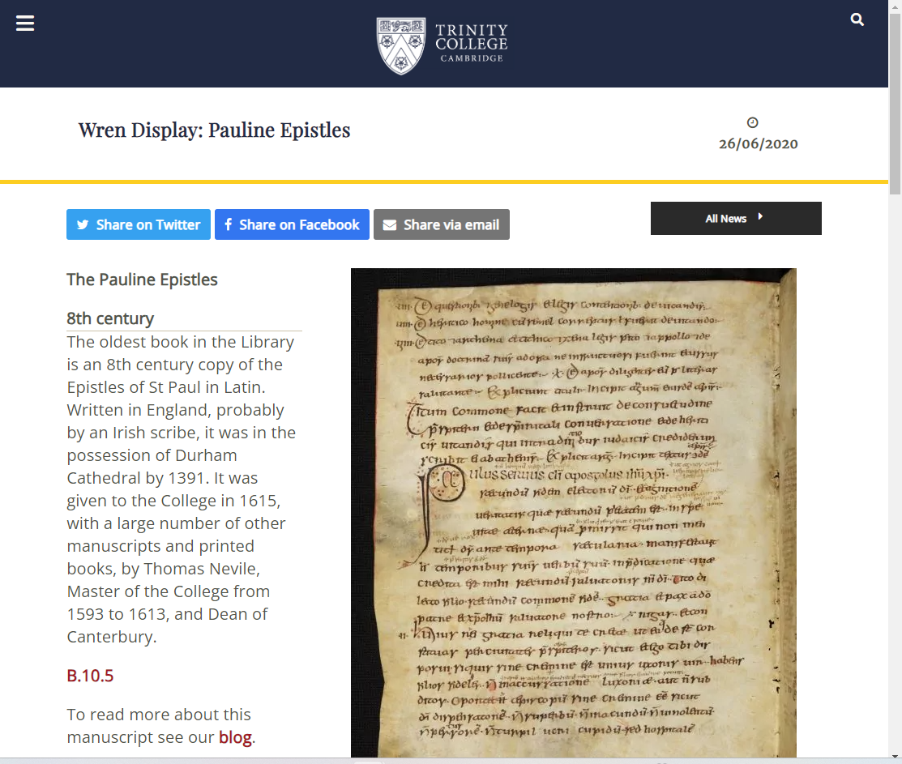

在电影《知无涯者》中，哈迪为了激励拉马努金，带他到了三一学院中的莱恩图书馆（Wren Library），和拉马努金说道：

In the film *The Man Who Knew Infinity*, Hardy, seeking to inspire Ramanujan, takes him to the Wren Library at Trinity College, Cambridge, and says to him:

那莱恩图书馆里到底有哪些稀世珍宝呢，坚定的无神论者哈迪，他列举的第一个图书馆藏品就是 —— **the Epistles of St. Paul 保罗书信**。

So what extraordinary treasures are actually kept in the Wren Library?

Remarkably, the very first item mentioned by Hardy—a staunch atheist—is **the Epistles of St Paul**.

莱恩图书馆的《保罗书信》是副本，是图书馆内最古老的书籍，大约写于八世纪，由拉丁语写成，可能是由一位爱尔兰的书记员抄录的。它于1391年归达勒姆主教座堂所有，于1615年被赠予给三一学院。

The Wren Library’s copy of **the Epistles of St Paul** is the **oldest** book in the library. Dating from around the eighth century, it was written in Latin and may have been copied by an Irish scribe. By 1391, it belonged to Durham Cathedral, and in 1615 it was presented to Trinity College.

保禄宗徒（即使徒保罗）作为新约全书半数的作者，作为神学家、哲学家、雄辩者，他可以说是基督信仰初期奠基人物，**挽乾坤于不败，立巍峨于万世**。《保罗书信》是一个总称，它指的是新约圣经（天主教）中的罗马书（罗）、格林多前书（格前）、格林多后书（格后）、迦拉达书（迦）、厄弗所书（弗）、斐理伯书（斐）、哥罗森书（哥）、得撒洛尼前书（得前）、得撒洛尼后书（得后）、弟茂德前书（弟前）、弟茂德后书（弟后）、弟铎书（铎）、费肋孟书（费） 和 作者存疑的希伯来书（希）。在这些书信中，保禄抽丝剥茧地捋清了基督信仰的由来和根基，冷峻缜密地论证了基督 *为什么可以 (is qualified to)* 并 *能够 (is able to)* 赐予我们救赎的大恩，关于劳动关于关于生死关于奉献生活，都提出了自己的真知灼见。

St Paul the Apostle, also known as the Apostle Paul, is traditionally associated with a substantial part of the New Testament. As a theologian, philosopher, and orator, he can rightly be regarded as one of the foundational figures of early Christianity—a man who helped shape the faith at a decisive moment in its history and whose towering influence has endured through the centuries.

The Pauline Epistles is a collective term referring, in the Catholic New Testament, to Romans, 1 Corinthians, 2 Corinthians, Galatians, Ephesians, Philippians, Colossians, 1 Thessalonians, 2 Thessalonians, 1 Timothy, 2 Timothy, Titus, Philemon, and Hebrews, whose Pauline authorship has long been disputed.

Throughout these letters, Paul patiently and methodically traces the origins and foundations of the Christian faith. With rigorous and incisive reasoning, he explains why Christ is both *qualified to* and *able to* bestow upon us the great gift of salvation. On subjects ranging from work and labour to life and death, from self-giving to the consecrated life, Paul offers insights of remarkable depth and enduring significance. 🟥